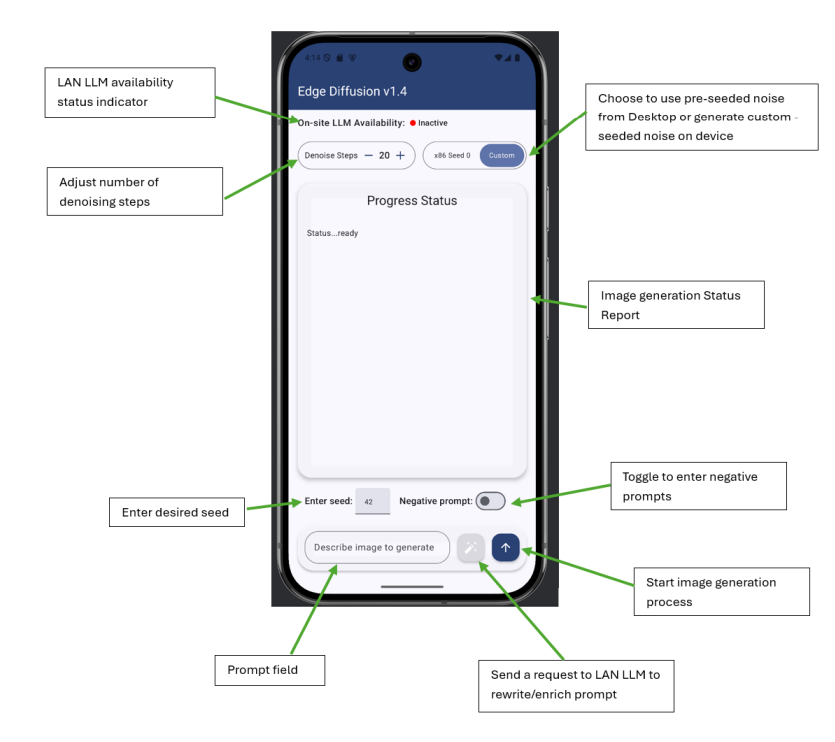
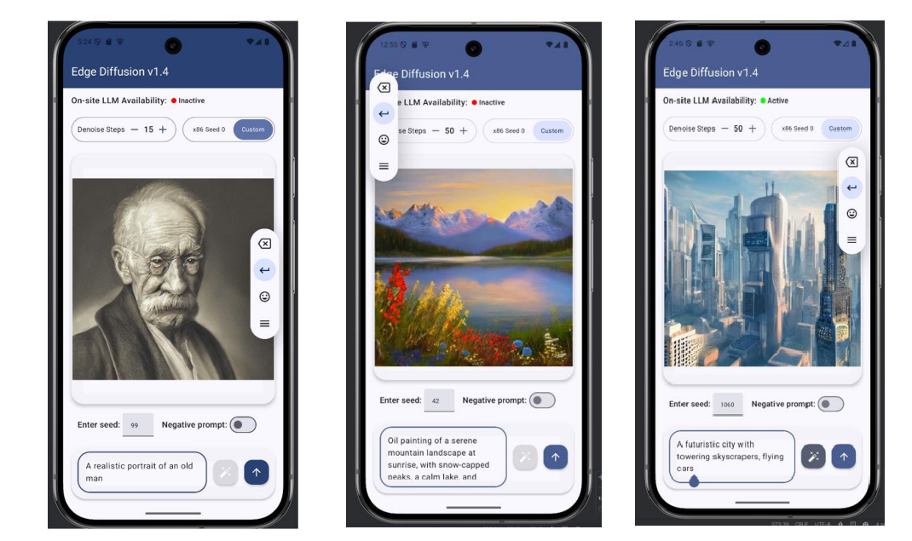
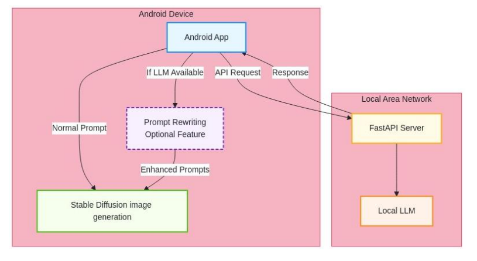
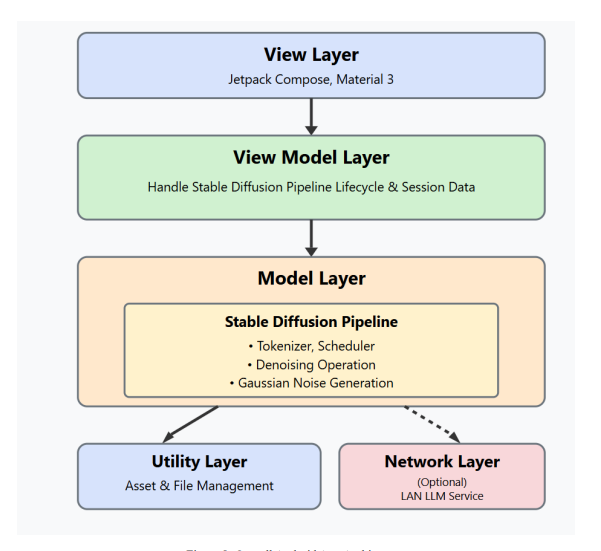
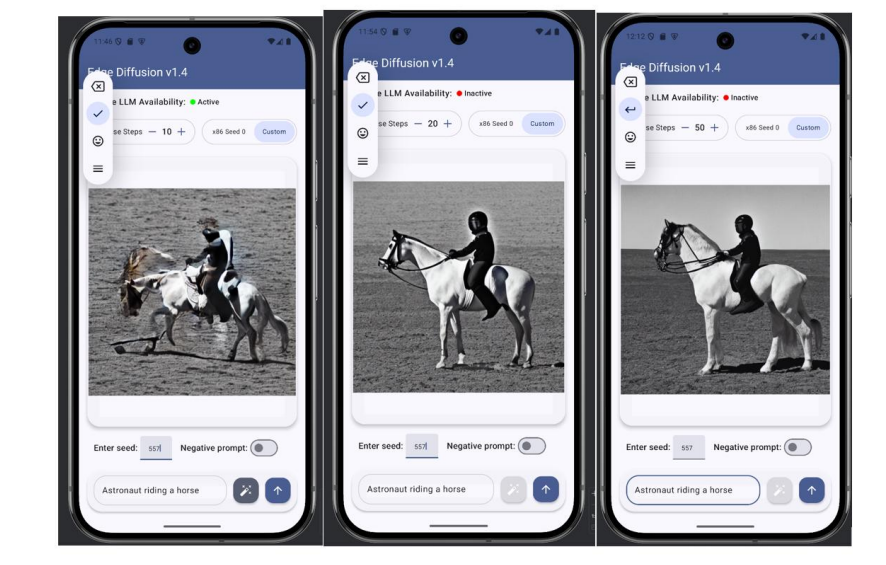
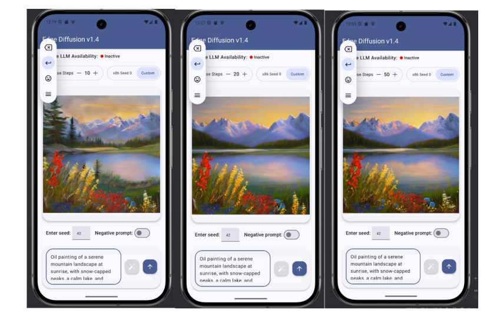
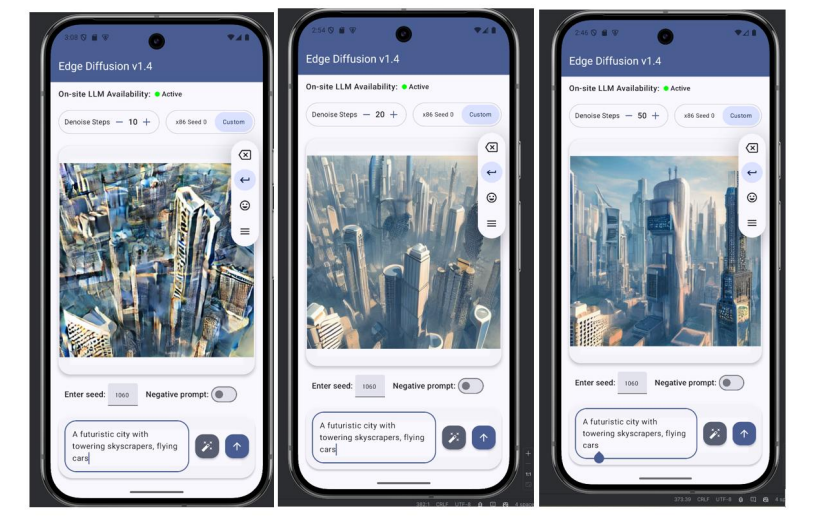

# 📱  Edge Diffusion v1.4

> *AI Image Generation in Your Pocket – Fully Offline*

Edge Diffusion v1.4 is an Android application that brings the power of Stable Diffusion v1.4 directly to your mobile device - no internet connection required! \
Designed and developed as part of my Bachelor’s Final Year Project, this app enables fully offline AI image generation, giving users complete control, privacy and creativity on the go.

## 📸 Screenshots
 \
*Prompt input screen with customizable parameters*  

 \
 *Example image generated on-device*  

# ✨ Key Features

- **Local Image Generation** using the Stable Diffusion pipeline — no cloud dependency.
- **Stable Diffusion v1.4 Pipeline** – fully implemented in Kotlin and optimized for Android.
- **Customizable Parameters** for creative control:
    - Prompt input for text-to-image generation
    - Denoising steps for fine-tuned detail
    - Seed control for reproducibility
    - Advanced settings (see screenshots below)
- **Privacy-First Design**: All computations happen on-device, ensuring privacy, security, and zero reliance on external servers.
- **Offline by Design**: Works without any internet connection — perfect for remote or low-connectivity environments.
- **LLM-Powered Prompt Enrichment (Optional)**: When connected to a local network, the app can leverage a LAN-hosted Language Model to enhance your prompts with richer details (e.g., colors, physical attributes), improving image quality and accuracy.

## 🛠 Tech Stack

| Category              | Technologies                               |
| --------------------- | ------------------------------------------ |
| Mobile App            | Kotlin, Jetpack Compose                    |
| AI & Model Deployment | PyTorch, ONNX, Hugging Face                |
| LAN Server (Optional) | FastAPI, TinyLlama                         |
| Other Tools           | Android Studio, Gradle, Visual Studio Code |

## 🏗 Architecture Diagram

 \
 *System Architecture*  

 
 \
 *App Architecture*  

 # 🖼 Image Quality vs Denoising Steps

Below are examples showing how image quality improves as the number of denoising steps increases:

> **Tip:** Typically, **20 steps** is a balanced trade-off between quality and speed.

### Example 1: Astronaut Riding a Horse

### Example 2: Oil Painting of Nature

### Example 3: Futuristic City

